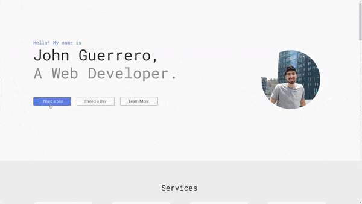

# Personal Portfolio
This is the second iteration of my Personal Portfolio that highlights my work and services. It includes my contact information and a little bit about me.

**Link to project:** https://johnsebastiandev.netlify.app/

## How It's Made:

**Tech used:** HTML, CSS, JavaScript

I made this portfolio using CSS Grid and Flexbox. I also used netlify's form attribute to allow me to receive messages from the contact form, and a bit of JS to let the user expand and collapse my projects section if they wish.

## Optimizations

Optimizations planned for this project are additional browser support and refactoring code.

## Lessons Learned:

I learned how to add an overlay to pictures. I needed to do this for my projects. I also learned how to use JS to add and hide whole sections of HTML with a single click, which was an awesome experience. Finally, I learned how to use netlify's hosting to allow users to send me messages using the contact form.

